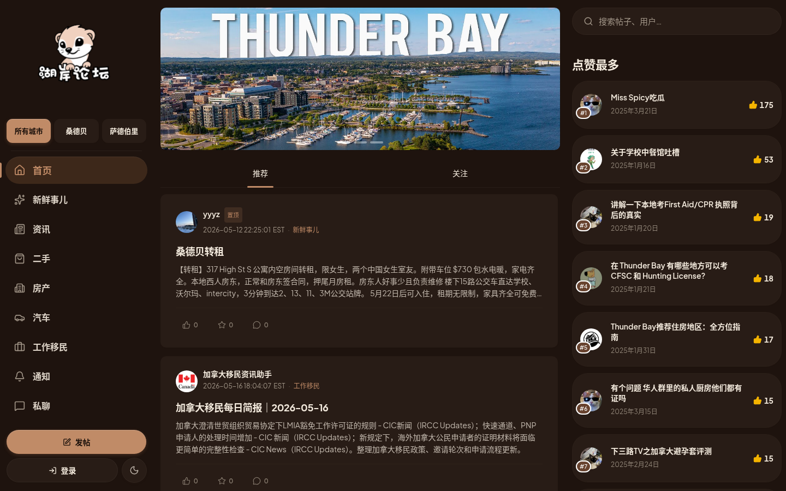
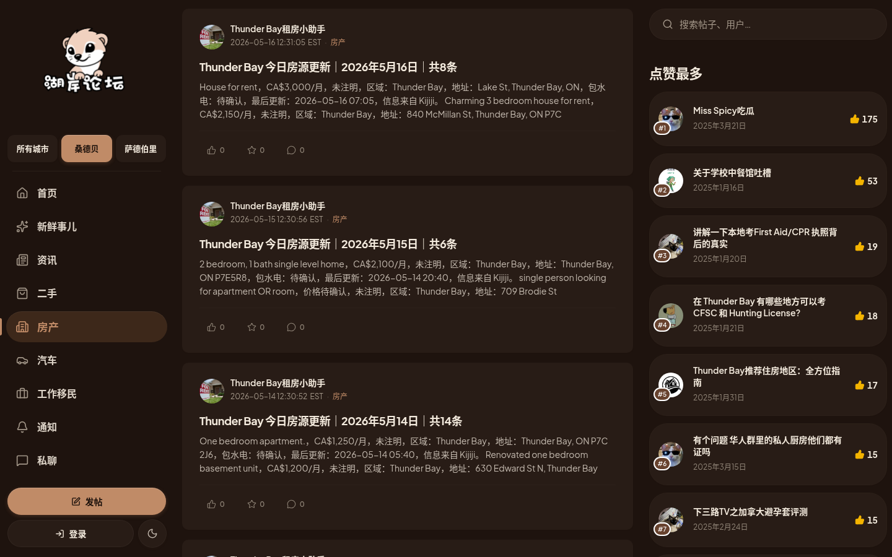
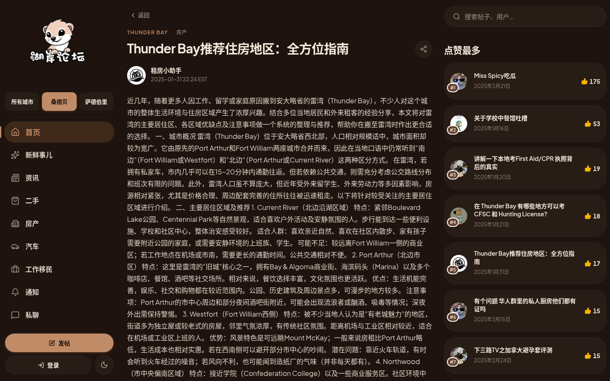
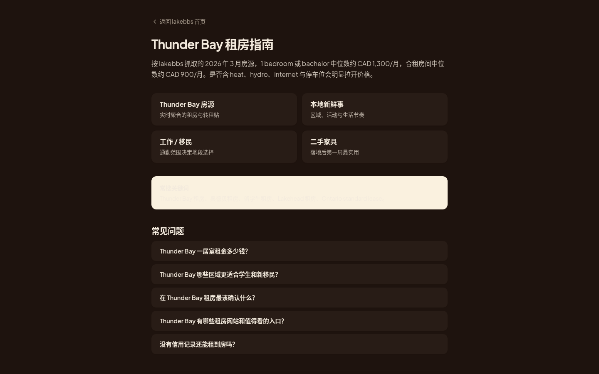
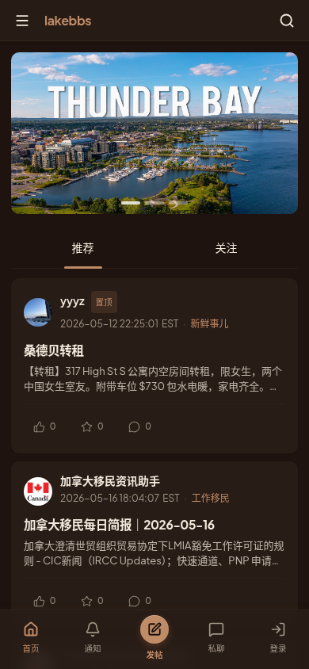

# lakebbs.ca

Public overview repository for **lakebbs** — a Chinese-language local community platform for Thunder Bay, Sudbury, and Ontario's smaller northern cities.

The private implementation lives in a separate source repository. This repository exists to explain what the product is, what problems it solves, how it is built, and how it is evolving — without exposing the live application source.

> **Live site** — [lakebbs.ca](https://www.lakebbs.ca)

---

## Positioning

lakebbs is not positioned as a generic forum clone. The product direction is stronger than that:

- a **city-aware Chinese local information platform**
- a **community layer for smaller Canadian cities** with weak information infrastructure
- a **hybrid** between forum, local marketplace, housing board, and settlement guide
- a **structured local product** rather than a single undifferentiated feed

For many Chinese students, newcomers, and local residents in places like Thunder Bay and Sudbury, useful information is fragmented. Housing details are scattered across chats, second-hand listings are inconsistent, job signals are noisy, and migration or settlement advice is hard to track in one place. lakebbs is aimed squarely at that gap.

---

## Screenshots

### Home — city-aware feed
City-scoped feed combining user posts, daily housing / job / Reddit digests, immigration briefings, and a "most-liked" sidebar.



### Section page — `/thunderbay/realEstate`
Each city × category gets its own surface. Daily aggregated listings flow in from Kijiji and other sources, alongside user transfer / sublet posts.



### Post detail
Long-form local guides (housing-area picks, immigration playbooks, first-aid licensing notes) sit alongside short community threads, with likes / saves / comments and "you might also like" recommendations.



### SEO / GEO landing page — `/landing/thunderbay-rent`
Dedicated landing pages turn local knowledge into long-lived discovery assets — rent medians, district picks, Ontario lease rules, FAQ schema for AI search engines.



### Mobile
Mobile-first responsive layout with a dedicated top bar and bottom navigation.



---

## Stack Signal

lakebbs was recently rewritten from its original Vue 2 + Express stack onto a modern TypeScript stack, while keeping the existing MySQL database intact.

| Layer | Technology |
| --- | --- |
| Framework | **Next.js 16** (App Router) |
| Language | **TypeScript** (strict) |
| UI | **React 19**, Server Components + Server Actions |
| Styling | **Tailwind CSS 4**, **Base UI**, **shadcn**, `tw-animate-css` |
| Theming | `next-themes` (dark / light) |
| Data layer | **Drizzle ORM** against **MySQL 5.7** (existing schema, no migration) |
| Auth | **NextAuth v5** (credentials + session) |
| Charts (admin) | **recharts** |
| Tests | **Vitest** |
| Deploy | systemd `lakebbs-next.service` on `:3477`, behind nginx |

---

## Product Surface

lakebbs is shaping into a Chinese local information and community platform for smaller Canadian cities that are usually underserved by mainstream product ecosystems.

The current surface combines:

### Community
- city-aware forum-style posting (`/[city]/[section]`) with image gallery support
- post detail with likes, saves, share, comments (latest / hottest / oldest sorting)
- compose modal for fast inline posting
- nested user profiles (`/u/[handle]`), follow / unfollow, blocklist

### Categories per city
- 新鲜事儿 (fresh news) · 资讯 (info) · 二手 (second-hand) · 房产 (real estate) · 汽车 (cars) · 工作移民 (work / immigration)

### Daily content automation (private side)
- Aggregated daily **housing digests** (Kijiji + other sources)
- Aggregated daily **job postings** (LinkedIn / Kijiji / City of Thunder Bay / etc.)
- Daily **Canada immigration / IRCC briefing**
- Daily **r/ThunderBay Reddit hot-thread digest** with translated highlights and selected comments

This keeps the feed alive even before the user community is fully critical mass — and turns lakebbs into a "daily-open" surface, not just a request-response forum.

### Messaging & notifications
- 1:1 private messaging (`/messages`) with conversation actions (block, archive)
- in-app notification center (`/notifications`)

### Search & discovery
- full-text search (`/search`) with a global search box
- "most-liked" sidebar on every page
- recommended posts at the bottom of every post detail

### Admin
- audience distribution (geographic) dashboard
- AI bot activity (per-bot PV, last-seen, purpose, docs)
- **GEO** (Generative Engine Optimization) readiness checklist and citation tracking
- content readiness signals for AI search engines

### SEO / GEO
- city pages, section pages, and dedicated **landing pages** for high-intent queries (rentals, immigration, Lakehead, RNIP, etc.)
- **dynamic `sitemap.xml`** — root + cities + sections + landing + newest 5,000 posts, 1-hour revalidation
- **dynamic `robots.txt`** with an AI-crawler allowlist and `Bytespider` crawl-delay
- structured data, OpenGraph, Twitter cards on key pages

---

## Why This Beats A Plain Forum

- **City-specific routing** gives each location its own information surface and SEO footprint
- **Category structure** makes housing, jobs, second-hand, and community flows separately usable
- **SEO + GEO landing pages** turn local knowledge into long-lived discovery assets
- **Daily aggregation bots** make the surface valuable even before user-generated content is dense
- **Trust-building flows** (profiles, follows, private messaging) help newcomers connect to real residents
- **One system** serves newcomers, students, renters, buyers, and local residents — not a different app per category
- A **typed, server-component-first** stack keeps the product fast and shippable as it grows

---

## Snapshot

| Item | Value |
| --- | --- |
| Product | lakebbs |
| Live domain | [lakebbs.ca](https://www.lakebbs.ca) |
| Public surface | `lakebbs-ca` (this repo) |
| Private source | private repository |
| Core regions | Thunder Bay, Sudbury, Northern Ontario |
| Core categories | rentals, second-hand, jobs, immigration, local guides, community posts |
| Product model | city-aware community platform with structured local information flows |
| Primary stack | TypeScript, Next.js 16, React 19, Drizzle ORM, MySQL 5.7, NextAuth v5, Tailwind 4 |
| Deploy model | systemd → nginx reverse proxy on a single VPS |

---

## Public Code Surface

Representative TypeScript examples in this repo:

- [examples/frontend-city-routing.ts](./examples/frontend-city-routing.ts) — city slug normalization and URL building for `/[city]/[section]`
- [examples/backend-city-feed.ts](./examples/backend-city-feed.ts) — Drizzle-backed city-scoped feed query as used in a Server Action / RSC

```ts
export function buildCityPath(
  citySlug: string = 'thunderbay',
  section: string = 'freshNews',
): string {
  const city = normalizeCitySlug(citySlug);
  const sectionKey = section.trim() || 'freshNews';
  return city === 'all' ? `/${sectionKey}` : `/${city}/${sectionKey}`;
}
```

---

## Repository Model

| Repository | Visibility | Purpose |
| --- | --- | --- |
| private source | Private | Next.js app, database schema, admin tools, content-aggregation jobs, deploy config |
| `lakebbs-ca` | Public | Product overview, public notes, roadmap, screenshots, representative code examples |

---

## Current Position

lakebbs has just completed a full rewrite from the original **Vue 2 + Express + Sequelize** stack to **Next.js 16 + React 19 + TypeScript + Drizzle**, while preserving the existing MySQL database. The implementation remains private; this repository tracks the product narrative and surfaces representative code patterns.

Active focus areas:
- expanding city coverage beyond Thunder Bay and Sudbury into more northern Ontario cities
- deepening **GEO** (generative engine optimization) so AI search engines cite local content accurately
- continuing to build out marketplace flows (housing, second-hand, jobs)
- growing the landing-page library for high-intent local queries (rentals, immigration, schools)

---

## Roadmap

- [ ] add more northern Ontario cities (Sault Ste. Marie, North Bay, Timmins) as first-class surfaces
- [ ] GEO depth: structured data, citation-friendly summaries, AI-crawler-aware caching
- [ ] marketplace v2: structured listings (price, beds, address, photos) for rentals and second-hand
- [ ] more high-intent landing pages around immigration pathways (RNIP, OINP streams) and schools (Lakehead, Confederation)
- [ ] open more architecture notes and representative TypeScript snippets in this public repo
